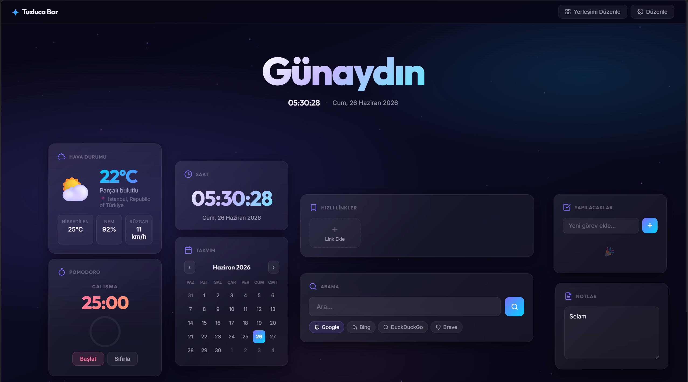

  

<h1 align="center">Tuzluca Bar</h1>

  <strong>Premium ve Tamamen Özelleştirilebilir Yeni Sekme Eklentisi</strong>

  
  

---

## 🌟 Genel Bakış

**Tuzluca Bar**, tarayıcınızın sıkıcı ve klasik "Yeni Sekme" sayfasını, tamamen kişiselleştirilebilir, estetik ve işlevsel bir kontrol paneline dönüştürür. Harika bir **Glassmorphism (Cam Efekti)** tasarım diline sahip olan bu eklenti, sunduğu "Serbest Pano" özelliği sayesinde araç kutularınızı (widget) ekranın **istediğiniz herhangi bir yerine** piksel hassasiyetiyle sürükleyip bırakmanıza olanak tanır.

## 📸 Ekran Görüntüleri

  

## ✨ Öne Çıkan Özellikler

- **🎨 Serbest Sürükle & Bırak (Free-Form):** Tam bir özgürlük! Kartlarınızı hiçbir ızgara kuralına bağlı kalmadan ekranın dilediğiniz köşesine yerleştirin.
- **💎 Premium Cam Tasarımı:** Bulanık cam efektleri (frosted glass), akıcı mikro animasyonlar ve şık arka planlar.
- **🌍 Çoklu Dil Desteği:** Türkçe, İngilizce, İspanyolca, Almanca, Fransızca ve daha birçok dil için anında çeviri.
- **⚙️ 10+ Entegre Araç (Widget):**
  - 🔍 **Arama Motorları:** Google, Bing, DuckDuckGo, Yahoo veya Yandex üzerinden hızlıca arama yapın.
  - ⛅ **Canlı Hava Durumu:** Seçtiğiniz şehrin anlık hava durumunu doğrudan panelinizde görün.
  - 🍅 **Pomodoro Sayacı:** Dahili odaklanma zamanlayıcısıyla verimliliğinizi artırın.
  - 📝 **Yapılacaklar & Hızlı Notlar:** Asla kaybolmayan, tarayıcı hafızasına kaydedilen not defteri ve görev listeniz.
  - 💱 **Döviz Kurları:** Güncel döviz kurlarını anlık olarak takip edin.
  - 🌐 **Dünya Saatleri:** Farklı ülkelerin yerel saatlerini anında kontrol edin.
  - 🔗 **Hızlı Linkler:** Favori web sitelerinizi ikonlarıyla birlikte panonuza iğneleyin.

## 🚀 Kurulum (GitHub Release)

Bu eklenti tamamen saf (Vanilla) JavaScript ve CSS ile yazıldığı için herhangi bir derleme aracına veya kurulum programına ihtiyaç duymaz!

### Kurulum Adımları:
1. GitHub **Releases (Sürümler)** sayfasından en güncel `Tuzluca_Bar_Release.zip` dosyasını indirin.
2. İndirdiğiniz bu ZIP dosyasını bilgisayarınızda bir klasöre çıkartın.
3. Tarayıcınızı açın ve Eklentiler sayfasına gidin:
   - Chrome: `chrome://extensions/`
   - Edge: `edge://extensions/`
4. Sağ üst köşeden (Edge'de sol altta olabilir) **"Geliştirici modu" (Developer mode)** anahtarını açık konuma getirin.
5. **"Paketlenmemiş öğe yükle" (Load unpacked)** butonuna tıklayın.
6. Az önce ZIP'ten çıkardığınız ve içinde `manifest.json` dosyası olan klasörü seçin.
7. Yeni bir sekme açın ve kişisel panonuzun tadını çıkarın!

## 💾 Yerel Hafıza & Gizlilik
Tuzluca Bar, kullanıcı gizliliğine tam saygı duyar. Tüm verileriniz (notlarınız, yapılacaklar listeniz, bağlantılarınız ve kart yerleşim koordinatlarınız) tarayıcınızın yerel hafızasına (`chrome.storage.local`) kaydedilir. **Hiçbir kişisel veri, hiçbir uzak sunucuya gönderilmez veya paylaşılmaz.**

## 🛠️ Kullanılan Teknolojiler
- **HTML5 & CSS3** (Gelişmiş animasyonlar, Flex düzenleri)
- **Vanilla JavaScript (ES6+)** (React, Vue veya ağır kütüphaneler yok, saf hız!)
- **Chrome Extension API** (Manifest V3 altyapısı)

## 📄 Lisans & Geliştirici
**Tuzluca Cloud Inc.** tarafından geliştirilmiştir. Beğenmediğiniz nokta olursa geri bildirim yapmaktan çekinmeyin.
